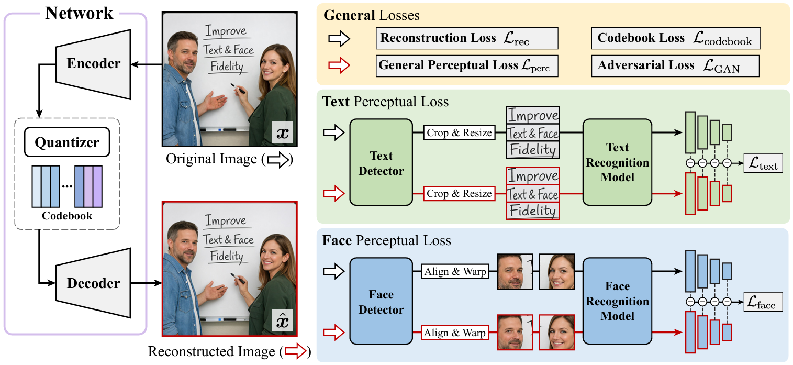
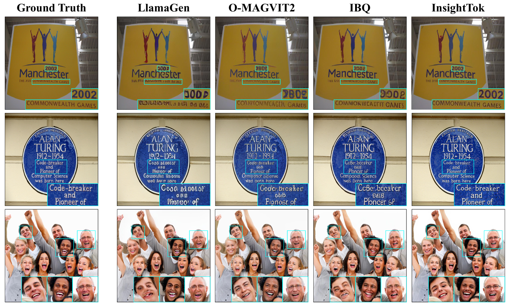
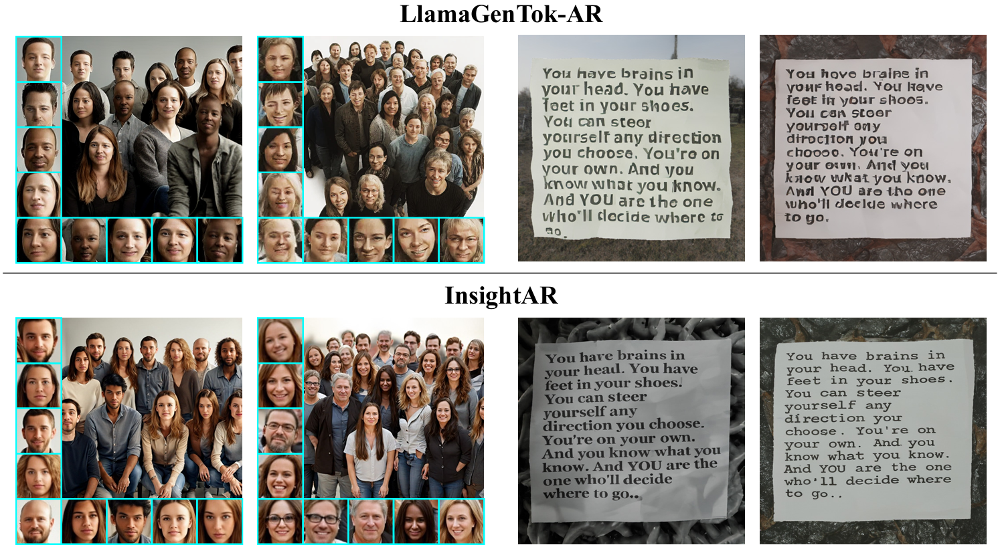

# InsightTok

**InsightTok: Improving Text and Face Fidelity in Discrete Tokenization for Autoregressive Image Generation**

<p align="center">
 <a href="https://scholar.google.com/citations?user=Q9cLkdcAAAAJ">Yang Yue<sup>1</sup></a> &emsp;
 <a href="https://scholar.google.com/citations?user=-ncz2s8AAAAJ">Fangyun Wei<sup>2</sup></a> &emsp;
 <a href="https://scholar.google.com/citations?user=P08KU1YAAAAJ">Tianyu He<sup>2</sup></a> &emsp;
<a href="https://openreview.net/profile?id=~Jinjing_Zhao1">Jinjing Zhao<sup>2</sup></a> &emsp;
<a href="https://nzl-thu.github.io/">Zanlin Ni<sup>1</sup></a> &emsp;
<a href="https://scholar.google.com/citations?user=55tpKaoAAAAJ">Zeyu Liu<sup>1</sup></a> &emsp;
</p>
<p align="center">
<a href="https://www.jiayiguo.net/">Jiayi Guo<sup>1</sup></a> &emsp;
<a href="https://scholar.google.com/citations?user=mbHPse8AAAAJ">Lei Shi<sup>2</sup></a> &emsp;
<a href="https://yuedong.shading.me/">Yue Dong<sup>2</sup></a> &emsp;
<a href="https://scholar.google.com/citations?view_op=list_works&hl=en&user=ksl2q9kAAAAJ">Li Chen<sup>2</sup></a> &emsp;
<a href="https://sites.google.com/view/ji-li-homepage">Ji Li<sup>2</sup></a> &emsp;
<a href="https://gaohuang-net.github.io/">Gao Huang<sup>1,✉</sup></a> &emsp;
<a href="https://www.dongchen.pro/">Dong Chen<sup>2,✉</sup></a> &emsp;
</p>

<p align="center">
<sup>1</sup>Tsinghua University&emsp;
<sup>2</sup>Microsoft Research
</p>

[](TODO) []([TODO](https://huggingface.co/yueyang2000/InsightTok))
<!-- [](TODO) -->


## Overview
InsightTok is a discrete visual tokenizer designed to improve the fidelity of **text** and **faces**, two of the most challenging yet perceptually important structures in autoregressive image generation.

Existing visual tokenizers are typically trained with generic reconstruction objectives, which do not explicitly prioritize these fidelity-critical regions. InsightTok addresses this limitation through **localized, content-aware perceptual supervision**, enabling substantially better preservation of textual content and facial details under a compact discrete bottleneck.


<p align="center">
  
</p>


## Highlights

- **State-of-the-art text and face reconstruction** among discrete visual tokenizers at the same compression rate, using **16× downsampling** and a compact **16,384-entry codebook**
- **Minimal additional training overhead** over a vanilla VQGAN-style tokenizer
- **No changes required to downstream generative modeling**. Readily compatible with standard autoregressive image generation pipelines
- **Tokenizer improvements transfer effectively** to downstream text-to-image generation, yielding clearer text and more faithful facial details


## Main Results

### Tokenizer Reconstruction

InsightTok delivers substantial improvements in both text and face reconstruction quality while maintaining strong general reconstruction performance.


<p align="center">
  
</p>


### Autoregressive Image Generation

The benefits of InsightTok also transfer to downstream autoregressive image generation.

<p align="center">
  
</p>

Below is a gallery of images generated by InsightAR.

<p align="center">
  
</p>


## Usage

Model checkpoints are available at [https://huggingface.co/yueyang2000/InsightTok](https://huggingface.co/yueyang2000/InsightTok).

InsightTok follows the standard VQGAN-style autoencoding interface:

```python
# image encoding
latents, _, [_, _, indices] = vq_model.encode(input_image_tensor)
# image decoding
recon_image_tensor = vq_model.decode(latents)
```

We also provide a simple image reconstruction demo in `recon_demo.py`:

```bash
python recon_demo.py \
  --ckpt_path <model-checkpoint-path> # will download from hf if not provided \
  --input assets/valset \
  --output outputs/recon
```

## Acknowledgments

This project builds upon the excellent open-source efforts of [LlamaGen](https://github.com/FoundationVision/LlamaGen), [Seed-Voken](https://github.com/tencentarc/seed-voken), [Janus-Pro](https://github.com/deepseek-ai/Janus), [TokBench](https://github.com/wjf5203/TokBench), [DocTR](https://github.com/mindee/doctr), and [InsightFace](https://github.com/deepinsight/insightface).

We sincerely thank the authors and contributors of these projects and benchmarks for making this research possible.


## Citation
If you find this work useful, please consider citing our paper.

```bibtex
@article{yue2026insighttok,
  title={InsightTok: Improving Text and Face Fidelity in Discrete Tokenization for Autoregressive Image Generation},
  author={Yue, Yang and Wei, Fangyun and He, Tianyu and Zhao, Jinjing and Ni, Zanlin and Liu, Zeyu and Guo, Jiayi and Shi, Lei and Dong, Yue and Chen, Li and Li, Ji and Huang, Gao and Chen, Dong},
  journal={arXiv preprint arXiv:TODO},
  year={2026}
}
```

## Contact
If you have any questions, please feel free to contact the authors.

Yang Yue: [yueyang22@mails.tsinghua.edu.cn](yueyang22@mails.tsinghua.edu.cn)